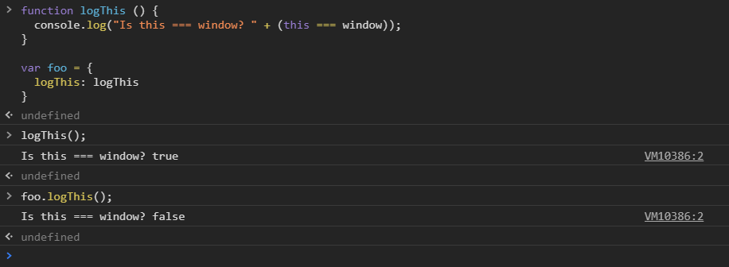

[`Programación con JavaScript`](../../Readme.md) > [`Sesión 01`](../Readme.md) > `Ejemplo 02`

---

## Ejemplo 2: `this` como método

### Objetivo

Diferenciar el valor de `this` en una función y en un método

#### Requisitos

En una nueva carpeta vamos a crear un archivo `HTML` en blanco llamado `index.html`:

```html
<html>
  <head>
    <meta charset="utf-8"/>
    <title>Ejemplo 2: this como método</title>
  </head>
  <body>
    <script type="text/javascript" src="./ejemplo-2.js"></script>
  </body>
</html>
```

Dentro de la misma carpeta creamos un archivo `ejemplo-2.js` que es donde
se trabajará este ejemplo. Finalmente abre el archivo `index.html`
en Chrome e inspecciona la consola para ver los resultados.

#### Desarrollo

Ya vimos que por default `this` hace referencia a la global `window`.

```javascript
console.log(this); // Window { … }
```

Aun cuando `this` se encuentre dentro de una función sigue apuntando a la global `window`.

```javascript
function foo() {
  console.log(this); 
}

foo(); // Window { … }
```

La situación cambia cuando una función es ejecutada como método de un objeto. Veamos un ejemplo:

```javascript
function logThis () {
  console.log("Is this === window? " + (this === window));
}

var foo = {
  logThis: logThis
}

logThis(); // Is this === window? true

foo.logThis(); // Is this === window? false
```

Cuando ejecutamos `logThis()` directamente `this` sigue haciendo referencia a `window`. Al llamar
`logThis()` como método de un objeto el valor de `this` cambia, ahora hace referencia al objeto que 
lo contiene, en este caso el objeto `foo`.


