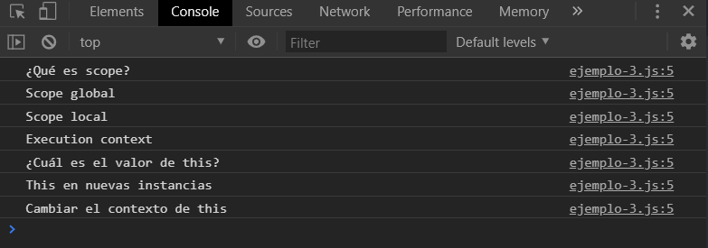

[`Programación con JavaScript`](../../Readme.md) > [`Sesión 01`](../Readme.md) > `Ejemplo 03`

---

## Ejemplo 3: Usando `call`

### Objetivo

Implementar el método `call` para cambiar el contexto de `this`

#### Requisitos

En una nueva carpeta vamos a crear un archivo `HTML` en blanco llamado `index.html`:

```html
<html>
  <head>
    <meta charset="utf-8"/>
    <title>Ejemplo 3: Usando call</title>
  </head>
  <body>
    <h1>Sesión 1</h1>
    <ul>
      <li>¿Qué es scope?</li>
      <li>Scope global</li>
      <li>Scope local</li>
      <li>Execution context</li>
      <li>¿Cuál es el valor de this?</li>
      <li>This en nuevas instancias</li>
      <li>Cambiar el contexto de this</li>
    </ul>
    <script type="text/javascript" src="./ejemplo-3.js"></script>
  </body>
</html>
```

Dentro de la misma carpeta creamos un archivo `ejemplo-3.js` que es donde
se trabajará este ejemplo. Finalmente abre el archivo `index.html`
en Chrome e inspecciona la consola para ver los resultados.

#### Desarrollo

En el `HTML` tenemos una lista no ordenada con los temas vistos en esta sesión. Vamos a empezar
seleccionando todos estos elementos del DOM. 

```javascript
var listItems = document.querySelectorAll('ul li');
```

El método `querySelectorAll()` devuelve un `NodeList`, una colección de nodos estática con todos 
los elementos que coincidan con el selector indicado. Recuerda que este selector es un selector de CSS,
por lo que `ul li` está seleccionando todos los `li` que se encuentren dentro de un `ul`.

Ahora usaremos un ciclo `for` para recorrer cada elemento de `listItems`

```javascript
for (var i = 0; i < listItems.length; i++) {
  // Code goes here...
}
```

Por último, vamos a mostrar en consola el texto dentro de cada elemento con `innerText` pero vamos a envolver
el `console.log()` dentro de una IIFE para poder usar el método `call` y definir el contexto de `this`.

```javascript
(function () {
  console.log(this.innerHTML);
}).call(listItems[i]);
```

En cada iteración del ciclo `this` hace referencia al nodo completo de `listItems[i]`.

```javascript
var listItems = document.querySelectorAll('ul li');

for (var i = 0; i < listItems.length; i++) {
  (function () {
    console.log(this.innerText);
  }).call(listItems[i]);
}
```


