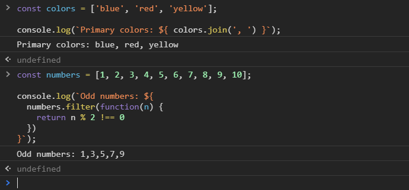

[`Programación con JavaScript`](../../Readme.md) > [`Sesión 02`](../Readme.md) > `Ejemplo 01`

---

## Ejemplo 1: Strings en ES6

### Objetivo

Diferenciar la nueva sintaxis para trabajar con strings.

#### Requisitos

En una nueva carpeta vamos a crear un archivo `HTML` en blanco llamado `index.html`:

```html
<html>
  <head>
    <meta charset="utf-8"/>
    <title>Ejemplo 1: Strings en ES6</title>
  </head>
  <body>
    <script type="text/javascript" src="./ejemplo-1.js"></script>
  </body>
</html>
```

Dentro de la misma carpeta creamos un archivo `ejemplo-1.js` que es donde
se trabajará este ejemplo. Finalmente abre el archivo `index.html`
en Chrome e inspecciona la consola para ver los resultados.

#### Desarrollo

Normalmente si queremos agregar el valor de una variable a una cadena de texto debemos concatenar ambos con el signo +
y siempre tener cuidado de agregar espacios en blanco para que no salgan ambos textos juntos. Si usamos comillas
invertidas podemos incluir variables dentro del string.

```javascript
// ES5
const name = 'John Doe';

console.log("Welcome " + name); // Welcome John Doe

// ES6
const name = 'John Doe';

console.log(`Welcome ${ name }`); // Welcome John Doe
```

Estas plantillas hacen más fácil crear cadenas de string con múltiples líneas.

```javascript
const message = `Welcome Back!
John Doe
`;

console.log( message ); 
// Welcome Back!
// John Doe
```

Además de variables también podemos usar expresiones matemáticas.

```javascript
const a = 10;
const b = 20;

console.log(`a + b = ${a + b}`); // a + b = 30 
```

Trabajar con arreglos.

```javascript
const colors = ['blue', 'red', 'yellow'];

console.log(`Primary colors: ${ colors.join(', ') }`); // Primary colors: blue, red, yellow
```

O incluso funciones de alto orden.

```javascript
const numbers = [1, 2, 3, 4, 5, 6, 7, 8, 9, 10];

console.log(`Odd numbers: ${ 
  numbers.filter(function(n) { 
    return n % 2 !== 0 
  }) 
}`); // Odd numbers: 1,3,5,7,9
```


