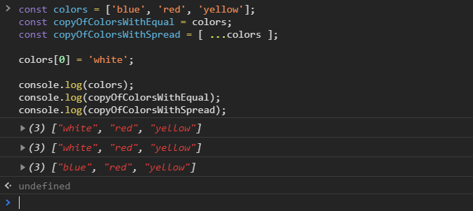
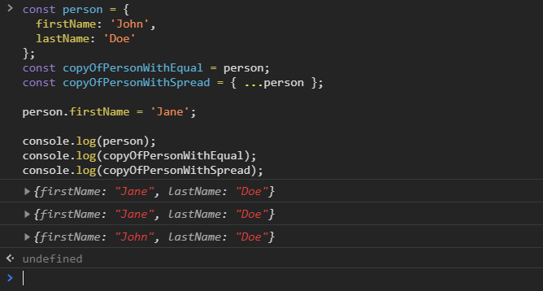

[`Programación con JavaScript`](../../Readme.md) > [`Sesión 02`](../Readme.md) > `Ejemplo 02`

---

## Ejemplo 2: Copiar arreglos y objetos

### Objetivo

Implementar el spread operator para copiar arreglos y objetos

#### Requisitos

En una nueva carpeta vamos a crear un archivo `HTML` en blanco llamado `index.html`:

```html
<html>
  <head>
    <meta charset="utf-8"/>
    <title>Ejemplo 2: Copiar arreglos y objetos</title>
  </head>
  <body>
    <script type="text/javascript" src="./ejemplo-2.js"></script>
  </body>
</html>
```

Dentro de la misma carpeta creamos un archivo `ejemplo-2.js` que es donde
se trabajará este ejemplo. Finalmente abre el archivo `index.html`
en Chrome e inspecciona la consola para ver los resultados.

#### Desarrollo

Cuando usamos el operador de asignación (`=`) para copiar un arreglo, los valores primitivos siguen apuntando a la misma
referencia por lo que cambios en un arreglo afectan al otro.

```javascript
const colors = ['blue', 'red', 'yellow'];
const copyOfColors = colors;

console.log(colors); // ["blue", "red", "yellow"]
console.log(copyOfColors); // ["blue", "red", "yellow"]

colors[0] = 'white';

console.log(colors); // ["white", "red", "yellow"]
console.log(copyOfColors); // ["white", "red", "yellow"]
```

La ventaja de usar el spread operator es que se crea una nueva referencia a los valores primitivos, por lo que cambios 
en el original no afectan la copia.

```javascript
const colors = ['blue', 'red', 'yellow'];
const copyOfColorsWithEqual = colors;
const copyOfColorsWithSpread = [ ...colors ];

colors[0] = 'white';

console.log(colors); // ["white", "red", "yellow"]
console.log(copyOfColorsWithEqual); // ["white", "red", "yellow"]
console.log(copyOfColorsWithSpread); // ["blue", "red", "yellow"]
```



Lo mismo sucede con los objetos.

```javascript
const person = {
  firstName: 'John',
  lastName: 'Doe'
};
const copyOfPersonWithEqual = person;
const copyOfPersonWithSpread = { ...person };

person.firstName = 'Jane';

console.log(person); // ["white", "red", "yellow"]
console.log(copyOfPersonWithEqual); // ["white", "red", "yellow"]
console.log(copyOfPersonWithSpread); // ["blue", "red", "yellow"]
```


