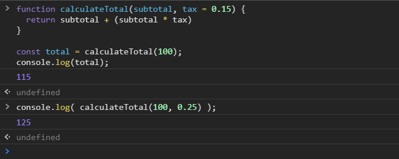

[`Programación con JavaScript`](../../Readme.md) > [`Sesión 03`](../Readme.md) > `Ejemplo 02`

---

## Ejemplo 2: Calcular total

### Objetivo

Asignar un valor por default a parámetros de una función

#### Requisitos

Crear un archivo `index.html` con la siguiente estructura:

```html
<html>
  <head>
    <meta charset="utf-8"/>
    <title>Ejemplo 2: Calcular total</title>
  </head>
  <body>
    <script type="text/javascript" src="./ejemplo-2.js"></script>
  </body>
</html>
```

Dentro de la misma carpeta creamos un archivo `ejemplo-2.js` que es donde
se trabajará este ejemplo. Finalmente abre el archivo `index.html`
en Chrome e inspecciona la consola para ver los resultados.

#### Desarrollo

La siguiente función nos permite calcular el total de una cuenta a partir del subtotal y el impuesto.

```javascript
function calculateTotal(subtotal, tax) {
  return subtotal + (subtotal * tax)
}

const total = calculateTotal(100, 0.15);
console.log(total);
```

Si queremos asumir que los impuestos siempre serán del 15% no podemos simplemente quitar `0.15` de los argumentos de la
función, eso haría que `total` sea igual a `NaN` ya que `tax` es `undefined` y no podemos hacer operaciones matemáticas
con valores que no sean numéricos. 

```javascript
function calculateTotal(subtotal, tax) {
  console.log(tax); // undefined
  return subtotal + (subtotal * tax)
}

const total = calculateTotal(100);
console.log(total); // NaN
```

Normalmente usaríamos un `if` para asignar un valor a `tax` en caso de ser `undefined`. 

```javascript
function calculateTotal(subtotal, tax) {
  if(tax === undefined) {
    tax = 0.15;
  }
  return subtotal + (subtotal * tax)
}

const total = calculateTotal(100);
console.log(total); // 115
```

Una forma más sencilla de obtener el mismo resultado es asignar un valor por default a `tax`.

```javascript
function calculateTotal(subtotal, tax = 0.15) {
  return subtotal + (subtotal * tax)
}

const total = calculateTotal(100);
console.log(total); // 115
```

Así asumiremos que los impuestos siempre serán del 15% pero nos da la flexibilidad de sobre escribir ese valor si es
necesario.


