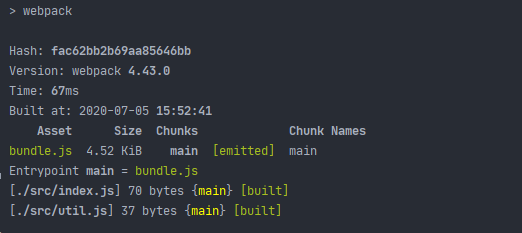
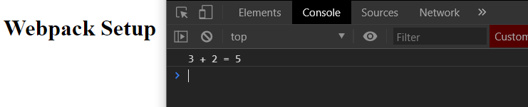

[`Programación con JavaScript`](../../Readme.md) > [`Sesión 06`](../Readme.md) > `Ejemplo 01`

---

## Ejemplo 1: Instalación y configuración

### Objetivo

Instalar y configurar webpack

#### Requisitos

Crear una nueva carpeta para este ejemplo llamada `demo`. Dentro de esta carpeta crearemos dos carpetas más, `src` y 
`dist`. Finalmente, dentro de `src` crearemos dos archivos `index.js` y `util.js`

```
demo
|- /dist
|- /src
    |- index.js
    |- util.js
```

#### Desarrollo

Para poder usar webpack debemos primero inicializar npm. Desde la consola o terminal debemos ejecutar `npm init -y`
estando en la ruta donde se encuentra la carpeta recién creada. Esto nos mostrará un mensaje confirmando que se creó el
archivo `package.json`


Ahora podemos instalar webpack junto con webpack-cli, este último nos permite ejecutar webpack desde la línea de 
comandos.

```
npm install --save-dev webpack webpack-cli
```

En la raíz del proyecto (al mismo nivel de `package.json`) vamos a crear un archivo de configuración llamado 
`webpack.config.js`, aquí definiremos el punto de entrada y el output.

```javascript
const path = require('path');

module.exports = {
  entry: './src/index.js',
  output: {
    path: path.resolve(__dirname, 'dist'),
    filename: 'bundle.js'
  }
}
```

También vamos a definir `mode` como `development`. La opción `production` crea un bundle optimizado para producción.

```javascript
const path = require('path');

module.exports = {
  entry: './src/index.js',
  output: {
    path: path.resolve(__dirname, 'dist'),
    filename: 'bundle.js'
  },
  mode: 'development'
}
```

Hasta ahora  la estructura del proyecto debería verse así:

```
demo
|- /dist
|- /node_modules
|- /src
|    |- index.js
|    |- util.js
|- package.json
|- package-lock.json
|- webpack.config.js
```

En `util.js` vamos a exportar un módulo para ser usado en `index.js`.

**`util.js`**
```javascript
export const sum = (a, b) => a + b;
```

**`index.js`**
```javascript
import { sum } from './util'

console.log(`3 + 2 = ${sum(3, 2)}`);
```

Ahora en `package.json` vamos a reemplazar `test` en `scripts`:

```json
"scripts": {
  "build": "webpack"
}
```

Con este script podemos ejecutar `npm run build` en la línea de comandos para generar el bundle.



Para ver los resultados vamos a crear un archivo `index.html` dentro de la carpeta `dist` agregando el bundle que
acabamos de generar.

```html
<!DOCTYPE html>
<html lang="en">
<head>
  <meta charset="UTF-8">
  <title>Webpack setup</title>
</head>
<body>
  <h1>Webpack Setup</h1>
  <script type="application/javascript" src="./bundle.js"></script>
</body>
</html>
```

Al abrir este archivo deberíamos poder ver en consola el `console.log()` que definimos en `index.js`.


