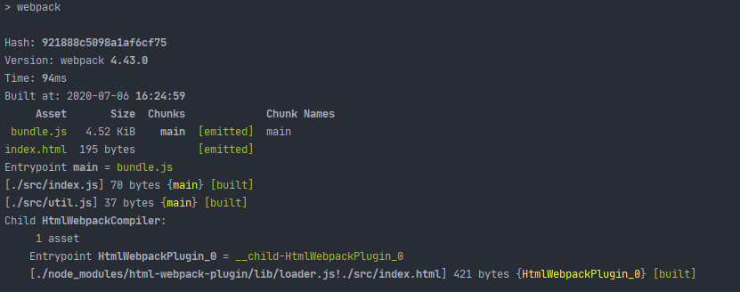
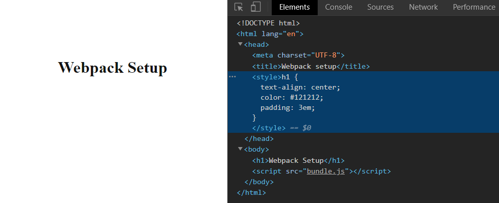

[`Programación con JavaScript`](../../Readme.md) > [`Sesión 06`](../Readme.md) > `Ejemplo 02`

---

## Ejemplo 2: Webpack y CSS

### Objetivo

Configurar loaders y plugins para que webpack pueda procesar archivos `.css`

#### Requisitos

Continuar con el código del [ejemplo 1](../Ejemplo-01/Readme.md)

#### Desarrollo

Vamos a eliminar el archivo `index.html` que creamos en el ejemplo anterior para permitir a webpack generarlo con la
ayuda del plugin `HtmlWebpackPlugin`. Después creamos un nuevo `index.html` pero dentro de la carpeta `src` sin incluir
el `<script>` que apunta al bundle.

```html
<!DOCTYPE html>
<html lang="en">
<head>
  <meta charset="UTF-8">
  <title>Webpack setup</title>
</head>
<body>
  <h1>Webpack Setup</h1>
</body>
</html>
```

Instalamos el plugin.

```
npm install --save-dev html-webpack-plugin
```

Ahora lo importamos en el archivo de configuración de webpack y lo agregamos a la propiedad `plugins`.

```javascript
const path = require('path');
const HtmlWebpackPlugin = require('html-webpack-plugin');

module.exports = {
  entry: './src/index.js',
  output: {
    path: path.resolve(__dirname, 'dist'),
    filename: 'bundle.js'
  },
  mode: 'development',
  plugins: [
    new HtmlWebpackPlugin({
      filename: 'index.html',
      template: './src/index.html'
    })
  ]
}
```

La propiedad `filename` define el nombre del output. `template` es la ruta del HTML que webpack usará como plantilla. 
Ahora cada vez que ejecutemos `npm run build` webpack va a generar un `index.html` con todos los bundles que requiera 
nuestro proyecto. 



Como ya vimos anteriormente, webpack solo procesa archivos `.js` y `.json`. Si queremos que webpack procese estilos como
archivos `.css` debemos usar loaders. En este ejemplo vamos a usar `css-loader` el cual le permite a webpack recolectar 
todos los estilos que encuentre y colocarlos en un string. Posteriormente usaremos `style-loader` para usar dicho string
y colocarlo dentro de las etiquetas `<style>` en nuestro archivo `index.html`

Empezamos instalando estas dos librerias.

```
npm install --save-dev css-loader style-loader
```

Dentro de `src` vamos a crear un archivo `app.css`.

```css
h1 {
  text-align: center;
  color: #121212;
  padding: 3em;
}
```

Ahora agregamos el loader en el archivo de configuración de webpack.

```javascript
const path = require('path');
const HtmlWebpackPlugin = require('html-webpack-plugin');

module.exports = {
  entry: './src/index.js',
  output: {
    path: path.resolve(__dirname, 'dist'),
    filename: 'bundle.js'
  },
  mode: 'development',
  plugins: [
    new HtmlWebpackPlugin({
      filename: 'index.html',
      template: './src/index.html'
    })
  ],
  module: {
    rules: [
      { test: /\.css$/, use: ['style-loader', 'css-loader'] }
    ]
  }
}
```

Con esto le estamos diciendo a webpack que siempre que encuentre un archivo `.css` debe compilarlo con `css-loader` y 
después usar `style-loader` con el output de css-loader. El orden en el que webpack aplica los loaders es de derecha a
izquierda.

Ahora solo debemos importar `app.css` en nuestro entry para que webpack lo considere como una dependencia.

**`index.js`**
```javascript
import { sum } from './util'
import './app.css'

console.log(`3 + 2 = ${sum(3, 2)}`);
```

Después de ejecutar `npm run build` podemos ver que webpack incluyó los estilos en el bundle final.


