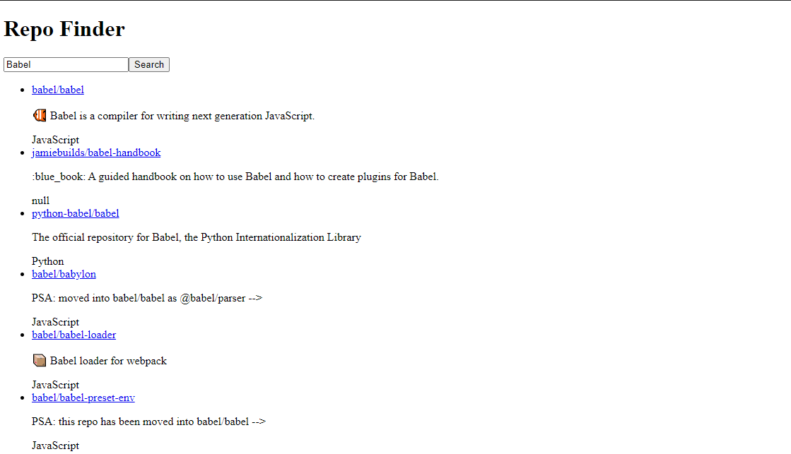

[`Programación con JavaScript`](../../Readme.md) > [`Sesión 07`](../Readme.md) > `Reto 01`

---

## Reto 1: Repo finder

### Objetivos

Crear un nuevo proyecto con webpack y babel.

#### Requisitos

Iniciar nuevo proyecto con `npm`.

```
npm init -y
```

#### Desarrollo

Vamos a retomar lo visto y practicado en sesiones anteriores para crear un buscador de repositorios usando la 
[API de Github](https://developer.github.com/v3/search/). 

Aprovechando las características de ES6 realizar las siguientes tareas:

- Instalar y configurar tanto webpack como babel. Se recomienda instalar Webpack Dev Server para facilitar el 
desarrollo.

- El `body` del HTML solo debe contener un `<div id='app'></div>`. Todos los elementos se crearán con JS.

- Agregar un título con el nombre del reto

- Agregar un input tipo texto

- Agregar un botón junto al texto

- Al hacer click en el botón se debe consultar la API de Github para buscar repositorios que estén relacionados al valor 
ingresado en el input. Esta búsqueda sólo debe hacerse si no está vacío el input.

- Mostrar los resultados en una lista no ordenada. Cada elemento de la lista debe contener el nombre completo del 
repositorio que deberá ser un link al repositorio en sí, la descripción del repositorio y el lenguaje en el que se 
encuentra el código.



<details>
  <summary>Solución</summary>

El [siguiente código](./repo-finder) debe tomarse como una guía ya que no hay una única solución al reto debido a la 
complejidad del mismo.


</details>
