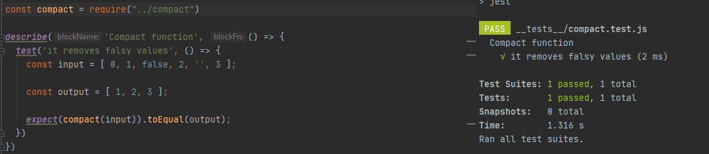

[`Programación con JavaScript`](../../Readme.md) > [`Sesión 08`](../Readme.md) > `Ejemplo 01`

---

## Ejemplo 1: Empezando con Jest

### Objetivo

Instalar, configurar y realizar una prueba unitaria con Jest

#### Requisitos

Crear una nueva carpeta para este ejemplo llamada `start-with-jest`. 

Inicializar npm ejecutando `npm init -y`.

#### Desarrollo

En este ejemplo vamos a crear una prueba unitaria para la función `compact` con la que trabajamos en la sesión anterior. 
Lo primero será instalar jest.

```
npm install --save-dev jest
```

Vamos a modificar el script `test` que tenemos en `package.json`.

```json
"scripts": {
  "test": "jest"
},
```

Vamos a crear un archivo `compact.js` donde exportaremos la función `compact`.

```javascript
function compact (array) {
  return array.filter(function (element) {
    return !!element
  })
}

module.exports = compact
```

Por default, Jest espera encontrar todos los tests dentro de una carpeta llamada `__tests__`. Después de crear esta
carpeta vamos a crear un archivo `compact.test.js`.

> Los tests pueden llevar la extensión `.test.js` o `.spec.js`

```
start-with-jest
|- /__tests__
|    |- compact.test.js
|- /node_modules
|- compact.js
|- package.json
|- package-lock.json
```

Ahora en `compact.test.js` vamos a crear un test block.

```javascript
const compact = require("../compact")

describe('Compact function', () => {
  // test
})
```

Nos encontramos con `describe`, este es un método de Jest para contener uno o varios tests que estén relacionados.
Recibe dos argumentos, un string con la descripción del test suite y un callback para contener los tests en sí.

```javascript
const compact = require("../compact")

describe('Compact function', () => {
  test('it removes falsy values', () => {
    // test
  })
})
```

Con el método `test` definimos nuestra prueba unitaria, al igual que `describe` recibe dos argumentos, un string para
definir el comportamiento que deseamos probar y un callback para contener el test. La función `compact` elimina todos
los valores falsy de un arreglo, en esta prueba usaremos dos arreglos, uno será el input y el otro será el valor 
esperado.

```javascript
const compact = require("../compact")

describe('Compact function', () => {
  test('it removes falsy values', () => {
    const input = [ 0, 1, false, 2, '', 3 ];
    
    const output = [ 1, 2, 3 ];
  })
})
```

Ahora usaremos otro método de Jest, `expect` junto con un _matcher_ para confirmar que `compact` retorna el valor 
esperado.

```javascript
const compact = require("../compact")

describe('Compact function', () => {
  test('it removes falsy values', () => {
    const input = [ 0, 1, false, 2, '', 3 ];

    const output = [ 1, 2, 3 ];

    expect(compact(input)).toEqual(output);
  })
})
```

Finalmente ejecutamos `npm run test` y Jest se encarga de lo demás mostrando un mensaje de confirmación al terminar.

```
PASS  ./__tests__/compact.test.js
  Compact function
    ✓ it removes falsy values (2 ms)
```


