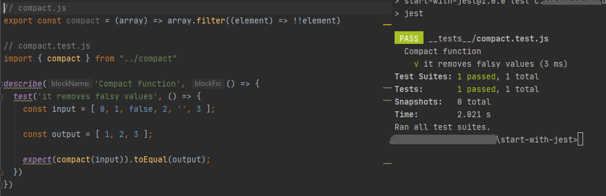

[`Programación con JavaScript`](../../Readme.md) > [`Sesión 08`](../Readme.md) > `Ejemplo 02`

---

## Ejemplo 2: Jest y Babel

### Objetivo

Instalar y configurar Babel para trabajar con Jest

#### Requisitos

Retomar el código del [Ejemplo 1](../Ejemplo-01/Readme.md)

#### Desarrollo

En el ejemplo anterior tuvimos que usar ES5, esto es porque Jest no transforma el código antes correr las pruebas 
unitarias. Afortunadamente podemos configurar Babel para que se encargue de esto. Lo primero será instalar las librerías 
que ya conocemos. 

```
npm install --save-dev @babel/core @babel/preset-env
```

Adicionalmente instalaremos el plugin `babel-jest`

```
npm install --save-dev babel-jest
```

Ahora en `package.json` agregaremos una configuración para Jest.

```json
"jest": {
  "transform": {
    "^.+\\.jsx?$": "babel-jest"
  }
}
```

Con esto le estamos diciendo que use el módulo `babel-jest` siempre que encuentre un archivo `.js`.

En la raíz del proyecto vamos a crear un archivo `.babelrc` para indicarle a Babel el preset que queremos usar.

```json
{
  "presets": ["@babel/preset-env"]
}
```

Con esto podemos modificar `compact.js` para usar arrow functions.

```javascript
export const compact = (array) => array.filter((element) => !!element)
```

Y cambiar `reqiure` por `import` en `compact.test.js`.

```javascript
import { compact } from "../compact"

describe('Compact function', () => {
  test('it removes falsy values', () => {
    const input = [ 0, 1, false, 2, '', 3 ];

    const output = [ 1, 2, 3 ];

    expect(compact(input)).toEqual(output);
  })
})
```

Con esto deberíamos poder ejecutar `npm run test` y el test debería seguir pasando.

```
PASS  ./__tests__/compact.test.js
  Compact function
    ✓ it removes falsy values (2 ms)
```


