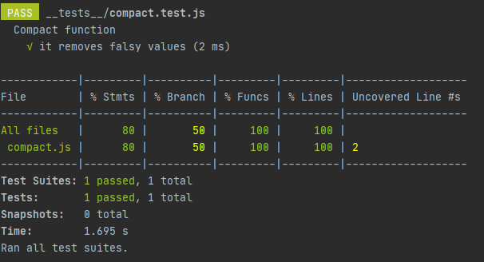
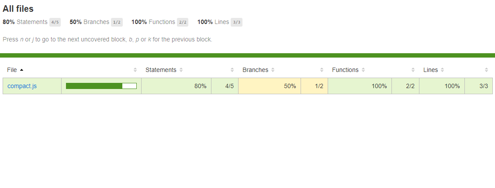
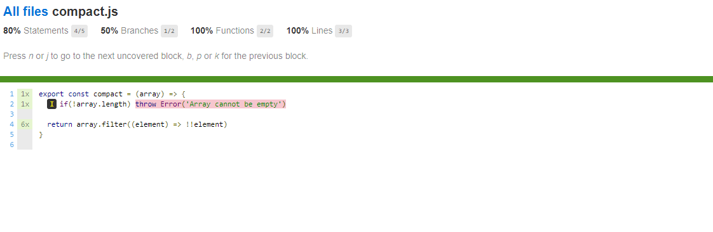

[`Programación con JavaScript`](../../Readme.md) > [`Sesión 08`](../Readme.md) > `Ejemplo 03`

---

## Ejemplo 3: Code coverage

### Objetivo

Recolectar cobertura de pruebas con Jest

#### Requisitos

Retomar el código del [Ejemplo 2](../Ejemplo-02/Readme.md)

#### Desarrollo

Cada vez que incluimos flujos de control en nuestro código, como condicionales o ciclos, estamos aumentando la 
[complejidad de nuestra aplicación](https://es.wikipedia.org/wiki/Complejidad_ciclom%C3%A1tica). Con el tiempo es muy 
fácil perder de vista cuántos caminos distintos puede tomar el código y no sabremos si las pruebas que estamos haciendo
abarcan todos los escenarios que deberíamos cubrir.

Tomemos por ejemplo la función `compact`, en este momento es bastante fácil leer la función, comprender lo que hace e 
incluso tener unit testing para esta función. Supongamos que como nuevo requerimiento nos piden validar que el arreglo
no está vacío.

```javascript
export const compact = (array) => {
  if(!array.length) throw Error('Array cannot be empty')

  return array.filter((element) => !!element)
}
```

La prueba que ya hicimos anteriormente seguirá pasando porque no hemos cambiado la funcionalidad de `compact`, al 
contrario, agregamos otro camino distinto en caso de contar con un arreglo vacío. Jest cuenta con _code coverage_, una
herramienta que nos permite verificar qué tanto porcentaje del código se está cubriendo con pruebas unitarias.

Vamos a volver a ejecutar las pruebas esta vez incluyendo la opción `--coverage`.

```
npm run test -- --coverage
```



En este reporte podemos ver que hay dos líneas fuera de cobertura. `% Branch` es de 50% porque solo estamos cubriendo 
uno de los escenarios posibles, en el que la condición no se cumple.

Haremos unos cambios en `package.json` para obtener estos reportes sin necesidad de pasar el flag `--coverage`.

```json
"jest": {
    "collectCoverage": true,
    "coverageReporters": ["html"],
    "transform": {
      "^.+\\.jsx?$": "babel-jest"
    }
  }
```

Ejecutamos nuevamente `npm run test`. En esta ocasión no veremos la tabla anterior pero se ha creado una carpeta 
`/coverage` en la raíz del proyecto. Si abrimos el `index.html` de esta carpeta podremos ver el mismo reporte.

En la raíz del proyecto vamos a crear un archivo `.babelrc` para indicarle a Babel el preset que queremos usar.



Además de ser interactivo, este reporte es más detallado. Si hacemos click en el link `compact.js` el reporte nos 
muestra exactamente qué líneas no han sido probadas aún.



Ahora sabemos qué parte del código nos hace falta probar.

```javascript
describe('Compact function', () => {
  test('it removes falsy values', () => {
    const input = [ 0, 1, false, 2, '', 3 ];

    const output = [ 1, 2, 3 ];

    expect(compact(input)).toEqual(output);
  })

  test('it throws error if array is empty', () => {
    expect(() => {
      compact([])
    }).toThrow();
  })
})
```

Este último test usa `.toThrow()` para probar que `compact` lanza un error cuando se llama con un arreglo vacío como 
argumento. Con esto la cobertura regresa al 100%.
