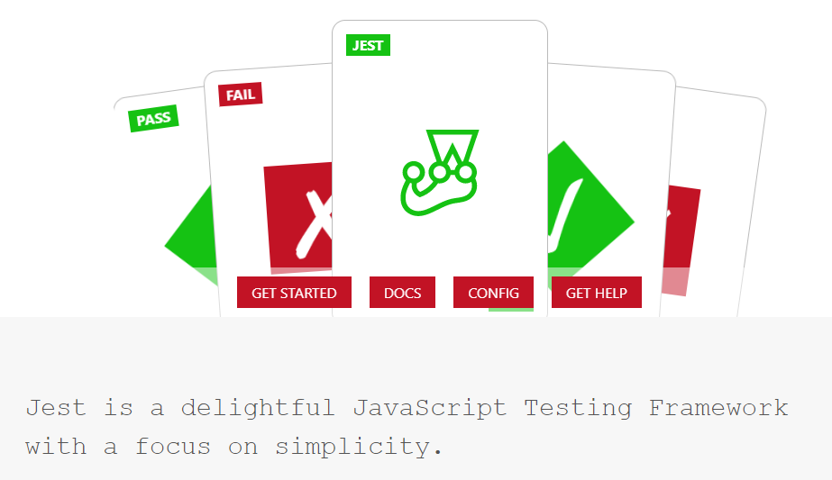

[`Programación con JavaScript`](../Readme.md) > `Sesión 08`

---

# Sesión 8: Unit Testing con Jest

🎯 **Objetivos:**

Integrar pruebas unitarias para validar que la aplicación funciona de acuerdo a cómo se diseñó

---

## 💻 Tabla de Contenidos

- **[¿Qué es unit testing?](#qué-es-unit-testing)**

- **[Test Driven Development](#test-driven-development)**

- **[Unit test vs integration test](#unit-test-vs-integration-test)**

- **[Jest](#jest)**

    - [Ejemplo 1: Empezando con Jest](./Ejemplo-01/Readme.md)

- **[Matchers](#matchers)**
    
    - [Ejemplo 2: Jest y Babel](./Ejemplo-02/Readme.md)
    
    - [Ejemplo 3: Code Coverage](./Ejemplo-03/Readme.md)
    
    - [Reto 1: Orden ascendente](./Reto-01/Readme.md)
    
    - [Reto 2: Siguiente número mayor](./Reto-02/Readme.md)

- **[Postwork](./Postwork/Readme.md)**
 
---

## ¿Qué es unit testing?

El desarrollo de software, una aplicación o incluso un sitio web requiere de conocimiento, experiencia, talento e
incluso un poco de arte. Es una labor bastante compleja y muy susceptible a errores o bugs. Muy difícilmente evitaremos
estos fallos si solo contamos con nuestras capacidades humanas, para ello nos apoyamos en pruebas unitarias.

Las pruebas unitarias nos permiten comprobar que el código funciona como esperamos. En esencia, una prueba unitaria o
unit test es un método para instanciar una pequeña porción de la aplicación o software y verificar su comportamiento de
manera aislada e independiente del resto de código. 

El unit testing consta de tres fases: La primera es inicializar una pequeña parte de la aplicación que se desea poner a
prueba (usualmente se le conoce como _system under test_), la segunda fase es aplicar algún estímulo a este sistema bajo
prueba, por último se observa el comportamiento resultante de la prueba. Si dicho comportamiento es consistente con las
expectativas el unit test pasa, de lo contrario falla y se toma como un indicio de una falla en el sistema. A estas tres
fases también se le conocen como **Arrange**, **Act** y **Assert**.

---

## Test Driven Development

El TDD o Test Driven Development, es una técnica de desarrollo donde el programador crea una prueba unitaria antes de 
escribir cualquier otro código (como no existe el código la prueba inicialmente falla), después el programador crea
escribe el código necesario para que la prueba pase.

La idea es que teniendo esa prueba inicial el programador pueda sentirse libre de refactorizar el código hasta obtener
un resultado bastante limpio y funcional. El concepto es bastante sencillo, pero como muchas otras cosas, la ejecución
es compleja. TDD requiere de una mentalidad completamente diferente de lo que la mayoría de programadores están 
acostumbrados, lo que implica una curva de aprendizaje inicial que podría ralentizar el desarrollo.

---

## Unit test vs integration test

En ocasiones se puede confundir el unit testing con integration testing. Como ya mencionamos, el primero es usado para
comprobar el funcionamiento de una pequeña porción de software completamente aislada del resto de código. Esto nos
permite verificar que cada parte del sistema (como unidad independiente) funciona correctamente.

Por otra parte, las pruebas de integración se usan para comprobar que distintas partes de un sistema pueden funcionar
en conjunto en un ambiente real de producción. Estas pruebas validan escenarios complejos que usualmente requieren de 
recursos externos. Podemos pensar en integration test como un usuario realizando operaciones de alto nivel en nuestro 
sistema.

---

## Jest



Jest es un test runner para JavaScript. Es decir, es una librearía de JavaScript que permite crear, ejecutar y 
estructurar tests. Es una de las librerías más populares para realizar unit testing debido a su simplicidad y facilidad 
de integrarse en proyectos que estén usando Babel, TypeScript, Node, React, Angular, Vue, etc.

#### 🕵 [Ejemplo 1: Empezando con Jest](./Ejemplo-01/Readme.md)

---

## Matchers

Los matchers nos permiten evaluar o probar valores de distintas formas.

```javascript
test('three times two is six', () => {
  expect(3 * 2).toBe(6)
})
```

El matcher `.toBe()` es la forma más sencilla de evaluar una igualdad. 

```javascript
test('object assignment', () => {
  const data = {one: 1};
  data['two'] = 2;
  expect(data).toEqual({one: 1, two: 2});
})
```

Para evaluar el valor de un objeto es mejor utilizar `.toEqual()` ya que revisa de manera recursiva cada campo de un 
objeto o arreglo.

```javascript
test('there is "or" in Hello World', () => {
  expect('Hello World').toMatch(/or/);
})
```

Podemos evaluar strings contra expresiones regulares usando `.toMatch()`.

```javascript
test('object assignment', () => {
  const numbers = [1, 2, 3, 4, 5];
  expect(numbers).toContain(3);
})
```

Usando el matcher `.toContain()` podemos evaluar si un arreglo o iterable contiene un elemento en particular. 
Internamente usa el `===`.

> Estos son algunos de los matchers más comunes. Consultar la [documentación](https://jestjs.io/docs/en/expect) para 
> conocer la lista completa.

#### 🕵 [Ejemplo 2: Jest y Babel](./Ejemplo-02/Readme.md)

#### 🕵 [Ejemplo 3: Code Coverage](./Ejemplo-03/Readme.md)

#### 💻 [Reto 1: Orden ascendente](./Reto-01/Readme.md)

#### 💻 [Reto 2: Siguiente número mayor](./Reto-02/Readme.md)

#### 🛡 [Postwork](./Postwork/Readme.md)
